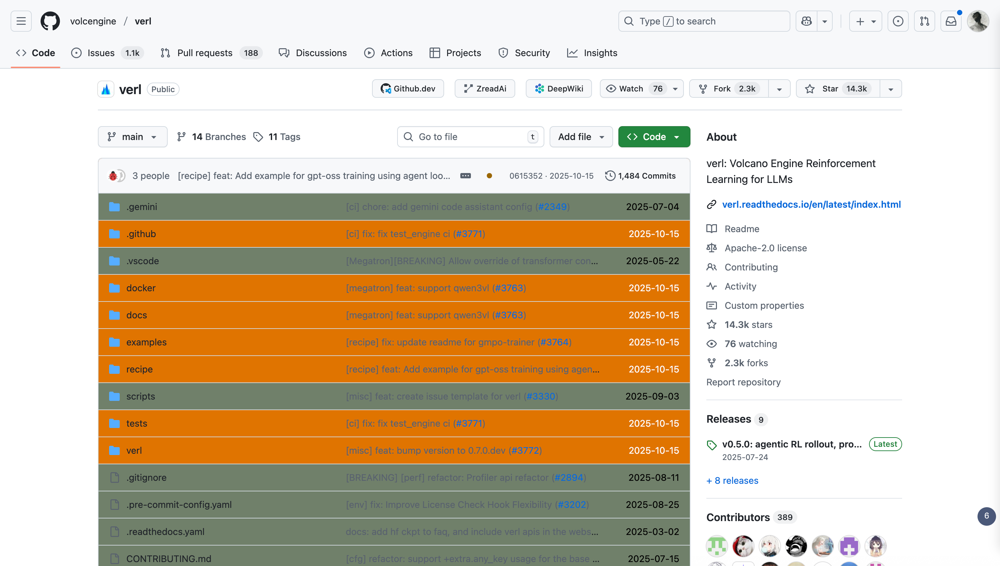
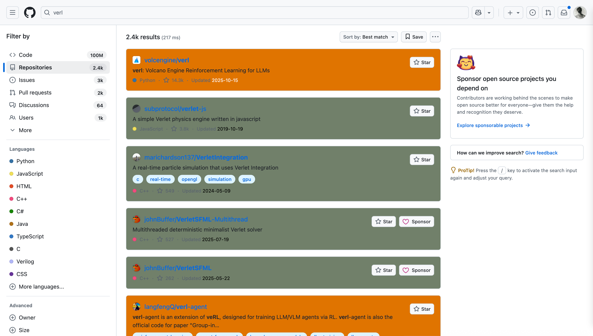

# GitHub Fresh Scan

[简体中文](#简体中文) · [English](#english)

---

  
   
  项目页面示例

  
   
  搜索页面示例

  
   
  设置页面示例

---

## 简体中文

GitHub Fresh Scan 是一款 Tampermonkey 用户脚本，为 GitHub 页面带来即时的活跃度提示和优雅的视觉标记，帮助你把注意力留给真正活跃的项目。

### ✨ 功能亮点

- **更新一目了然**：用自定义配色映射最近更新时间（默认 30 天内为橙色，高于阈值转为柔和低饱和色）。
- **多场景覆盖**：仓库文件列表、搜索结果、用户/组织仓库列表、Awesome 列表均可自动识别。
- **随心定制**：时间阈值、背景色、字体、文件夹图标、排序方式、时间格式等全部可在设置面板微调。
- **Awesome 增强**：可选 GitHub Token，自动获取 Star 数与更新时间，辅助筛选真正维护中的宝藏项目。

### 🚀 快速上手

1. 安装 [Tampermonkey](https://www.tampermonkey.net/) 浏览器扩展。
2. 点击安装脚本：[GitHub Fresh Scan](https://github.com/CzsGit/github-fresh-scan/raw/main/fresh_scan.js)。
3. 打开任意 GitHub 页面，脚本即刻生效。

默认行为：
- 仓库页高亮近期更新文件，并格式化为 `yyyy-MM-dd`。
- 搜索结果页为活跃仓库着色，降低停更项目的存在感。

### 🎛 自定义面板

通过 Tampermonkey 图标 → GitHub Fresh Scan → 设置面板，可配置：

- 主题：单独调校 light/dark，或设为 auto 同步系统主题。
- 时间阈值：按日/周/月/年自定义刷新频率判断。
- 背景/字体/文件夹颜色：定义活跃与非活跃的视觉语言。
- 时间格式化与文件排序：根据个人习惯选择展示方式。
- Awesome Token：为 Awesome 列表开启 Star/更新时间增强。

### 💡 技术细节

- **智能感知**：精准识别 GitHub 页面类型，兼容 PJAX、React 等动态刷新机制。
- **性能友好**：WeakSet 去重、节流防抖、IntersectionObserver 懒加载，让页面保持丝滑。
- **稳健依赖**：基于 jQuery 兼容层、SweetAlert2、Pickr、Luxon 构建，开箱即用。

### 🤝 贡献与鸣谢

- 欢迎通过 Issue、Pull Request 分享改进建议，一起让工具更好用。
- 部分思路参考自 [GitHub-Freshness](https://github.com/rational-stars/GitHub-Freshness)，致谢前辈灵感与付出。

### 📄 开源协议

Apache License 2.0

---

## English

GitHub Fresh Scan is a Tampermonkey userscript that paints GitHub pages with subtle activity cues, so you can focus on repositories that are truly alive.

### ✨ Highlights

- **Instant activity signal**: Map last-update freshness to customizable colors (orange by default within 30 days, muted tones beyond the threshold).
- **Broad coverage**: Repository file lists, search results, user/org repository pages, and Awesome lists are all supported.
- **Fine-grained control**: Tune thresholds, background/font/folder colors, sort order, and date format directly from the settings panel.
- **Awesome boost**: Optionally enrich Awesome lists with stars and update timestamps via your GitHub token.

### 🚀 Quick Start

1. Install the [Tampermonkey](https://www.tampermonkey.net/) extension.
2. Install the script: [GitHub Fresh Scan](https://github.com/CzsGit/github-fresh-scan/raw/main/fresh_scan.js).
3. Visit any GitHub page and the script springs into action.

Out of the box:
- Repository pages highlight files updated in the past 30 days and show dates as `yyyy-MM-dd`.
- Search results surface active repositories while toning down stale ones.

### 🎛 Settings Panel

Tampermonkey icon → GitHub Fresh Scan → Settings grants access to:

- Themes: tweak light/dark separately or follow the system automatically.
- Time threshold: choose days/weeks/months/years to match your definition of “fresh”.
- Colors: craft your own palette for backgrounds, text, and folder icons.
- Formatting & sorting: toggle date formatting and file ordering as you like.
- Awesome token: add your GitHub personal access token to fetch stars and update times.

### 💡 Under the Hood

- **Smart detection**: Handles GitHub’s PJAX transitions and React-driven re-renders gracefully.
- **Performance minded**: WeakSet tracking, debounced observers, and IntersectionObserver keep things efficient.
- **Trusted stack**: Built on jQuery, SweetAlert2, Pickr, and Luxon for reliability and polish.

### 🤝 Contributing & Credits

- Issues and pull requests are always welcome—let’s keep refining it together.
- Inspired in part by [GitHub-Freshness](https://github.com/rational-stars/GitHub-Freshness); grateful for the trail they blazed.

### 📄 License

Apache License 2.0
